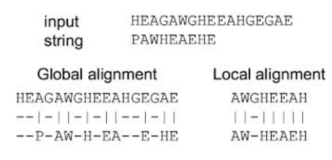

# Biological sequence aligment

biological sequence is the primary structure of a DNA, RNA and proteins. Each one of those are made up of a lienar arragnement of nucleotide or amino acids. 

### Now why do we need to align these sequences?

we can get more infomation about:

- Functional Relationships 
 - Structural Relationships 
 - Evolutionary Relationships 

 ### Now there are two types of Aligments

## 1.Global aligmment 
  -  Tries to align an entire sequence 
   - Align all lettes from a query and target 
   -Suitable for closely related sequences 
## 2. Local Alignments 

   - Align regions having highest similarities 
 - Align substrings of taget with substring of queries 
  - Suitable for more divergent sequences 

  
  

  Needleman-Wunsch is the most common Global Alignment Algorithm

  to see a better exmaple of this algorithm visit this calculator site: https://bioboot.github.io/bimm143_W20/class-material/nw/

